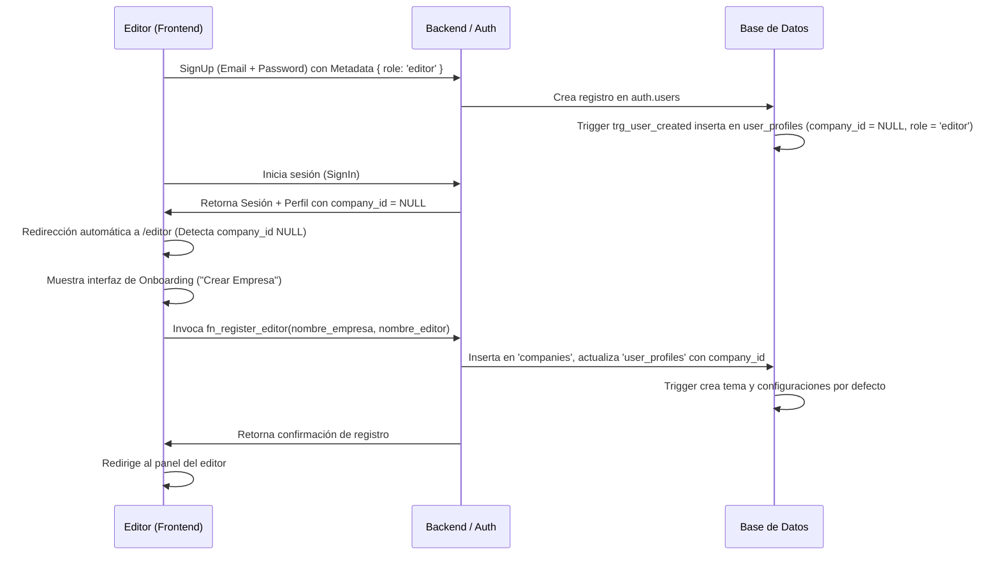
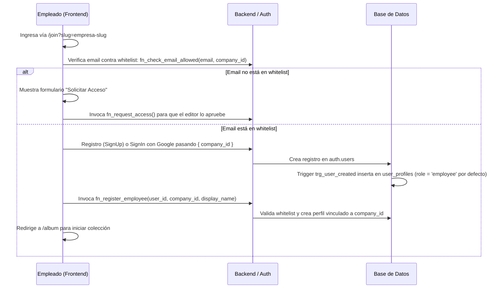

# Documentación de Entrega Técnica: Migración del Backend de Supabase a Infraestructura Propia

Este documento proporciona una referencia técnica exhaustiva del backend actual basado en Supabase para el proyecto **AlbumCorp**. Está diseñado para el equipo de TI que se encargará de migrar el sistema a una infraestructura propia (por ejemplo, un backend en Node.js, Python, Go o similar, junto con una base de datos PostgreSQL independiente).

---

## 1. Resumen del Sistema

**AlbumCorp** es una aplicación web que permite a los empleados de una organización coleccionar un álbum virtual de cromos (stickers) interactivos de sus compañeros de trabajo. Fomenta la integración, el intercambio (networking) y la gamificación dentro de la empresa.

### Tipos de Usuario
El sistema opera bajo una arquitectura multi-inquilino (multi-tenant) basada en el identificador `company_id`. Existen dos roles de usuario en el sistema:

1. **Editor (Administrador de Recursos Humanos / TI):**
   - Accede a través de la ruta `/editor`.
   - Administra los datos de su empresa, crea y ordena secciones del álbum, gestiona el listado de empleados (añade, edita, da de baja y genera códigos únicos).
   - Configura los parámetros de los sobres (tamaño del sobre, frecuencia de obtención, límite acumulable y probabilidades de aparición por rareza).
   - Controla la lista de correos permitidos (whitelist) y gestiona (aprueba o rechaza) las solicitudes de acceso pendientes de nuevos empleados.
   - Otorga o revoca cromos de categoría "Legendaria" a empleados de manera directa.

2. **Empleado (Usuario Coleccionista):**
   - Accede a través de las rutas `/album`, `/exchange`, y `/join`.
   - Obtiene y abre sobres de cromos de forma diaria/periódica según la configuración de la empresa.
   - Pega los cromos obtenidos en su álbum digital (con efecto interactivo de hojeado de páginas).
   - Administra sus cromos repetidos en un baúl virtual (duplicados).
   - Propone y acepta ofertas de intercambio (trades) multilaterales o dirigidos con otros empleados de la misma empresa.
   - Desbloquea hitos de recolección (milestones) basados en el porcentaje de avance de su álbum y recibe notificaciones dinámicas.

### URL de Producción Actual
* **URL:** `https://corp-album.vercel.app` (Configurada y desplegada en Vercel)

---

## 2. Stack Tecnológico

El proyecto está diseñado bajo una arquitectura de cliente pesado (Single Page Application / Multi-Page Application híbrida) que consume directamente servicios en la nube (Backend-as-a-Service).

* **Frontend:**
  - **Estructura y Lógica:** HTML5 vanilla, CSS3 y Vanilla JavaScript (ES6 Modules).
  - **Bundler / Servidor de Desarrollo:** Vite `^5.2.11`.
  - **Librerías Clave del Cliente:**
    - `page-flip` `^2.0.7`: Utilizada para renderizar y animar el hojeado del álbum físico en 3D.
    - `gsap` `^3.15.0`: Motor de animación para los efectos de apertura de sobres y pegado de cromos.
    - `driver.js` `^1.4.0`: Utilizado para guiar interactivamente a los nuevos usuarios (onboarding).
    - `exceljs` `^4.4.0`: Utilizado en el panel del editor para exportar listas de códigos y reportes a hojas de cálculo.

* **Backend actual (Supabase):**
  - **Base de Datos:** PostgreSQL (alojado en Supabase) con extensiones activas de UUID y JSONB.
  - **Autenticación (Auth):** Supabase GoTrue (Manejo de sesiones, Email/Password y proveedor OAuth de Google).
  - **Almacenamiento (Storage):** Supabase Storage para almacenar archivos multimedia (fotos de empleados, portadas de álbumes, insignias de hitos y assets globales).
  - **SDK del Cliente:** `@supabase/supabase-js` `^2.43.2` (utilizado para consultas de base de datos directas, llamadas RPC y operaciones de storage).

* **Despliegue (Hosting):**
  - **Vercel:** Aloja el código de frontend estático y maneja las redirecciones mediante [vercel.json](file:///c:/Users/ALVARO%20DE%20ALBA/corp-album/vercel.json).

---

## 3. Esquema de Base de Datos

Toda la base de datos reside en PostgreSQL en el esquema `public`. Las políticas RLS están activas a nivel de tabla.

### 3.1. Tabla: `companies`
Almacena las empresas registradas en el sistema.
* **RLS Activo:** Sí
* **Columnas:**
  - `id` (`uuid`, PK, Default: `gen_random_uuid()`): Identificador único de la empresa.
  - `name` (`text`, NOT NULL): Nombre comercial de la empresa.
  - `slug` (`text`, UNIQUE, NOT NULL): URL slug amigable autogenerado.
  - `created_at` (`timestamptz`, Default: `now()`): Fecha de registro.

### 3.2. Tabla: `user_profiles`
Perfiles detallados de los usuarios (editores y empleados) autenticados en el sistema.
* **RLS Activo:** Sí
* **Columnas:**
  - `id` (`uuid`, PK): ID del usuario que referencia directamente a `auth.users.id`.
  - `company_id` (`uuid`, Nullable): FK que apunta a `companies.id`.
  - `role` (`text`, Default: `'employee'`): Rol del usuario. Constraint: `role IN ('editor', 'employee')`.
  - `display_name` (`text`, Nullable): Nombre visible del usuario.
  - `name_set` (`boolean`, Default: `false`): Bandera que indica si el empleado ya configuró su nombre visible.
  - `created_at` (`timestamptz`, Default: `now()`): Fecha de creación del perfil.

### 3.3. Tabla: `album_theme`
Configuración visual e identidad de marca del álbum de cada empresa.
* **RLS Activo:** Sí
* **Columnas:**
  - `id` (`uuid`, PK, Default: `gen_random_uuid()`): Identificador único del tema.
  - `company_id` (`uuid`, UNIQUE, NOT NULL): FK que apunta a `companies.id`.
  - `company_name` (`text`, Nullable): Nombre de la empresa a mostrar en el álbum.
  - `logo_url` (`text`, Nullable): URL del logo corporativo.
  - `cover_image_url` (`text`, Nullable): URL de la portada exterior del álbum.
  - `inner_cover_image_url` (`text`, Nullable): URL de la contraportada interior inicial.
  - `back_inner_image_url` (`text`, Nullable): URL de la contraportada interior final.
  - `back_cover_image_url` (`text`, Nullable): URL de la contraportada exterior del álbum.
  - `page_bg_color` (`text`, Default: `'#F4EFE6'`): Color de fondo de las páginas del álbum.
  - `page_border_color` (`text`, Default: `'#C8A96E'`): Color del borde de las páginas.
  - `page_border_width` (`integer`, Default: `2`): Ancho del borde de las páginas en píxeles.
  - `spine_color` (`text`, Default: `'#2C2416'`): Color del lomo central del libro virtual.
  - `sticker_empty_bg` (`text`, Default: `'#E8E2D9'`): Color de fondo del espacio vacío para cromos no obtenidos.
  - `sticker_empty_border` (`text`, Default: `'#C0B8AD'`): Borde del espacio vacío para cromos.
  - `sticker_filled_border` (`text`, Default: `'#C8A96E'`): Borde del cromo una vez pegado en su posición.
  - `font_family` (`text`, Default: `'Playfair Display', Georgia, serif`): Fuente tipográfica del álbum.
  - `primary_text_color` (`text`, Default: `'#2C2416'`): Color de texto principal.
  - `secondary_text_color` (`text`, Default: `'#7A6E5F'`): Color de texto secundario.
  - `accent_color` (`text`, Default: `'#C8A96E'`): Color de acento de la interfaz del álbum.
  - `palette_name` (`text`, Default: `'obsidiana'`): Nombre de la paleta de colores activa.
  - `page_backgrounds` (`jsonb`, Default: `'{}'`): Mapeo de fondos específicos para cada número de página.
  - `custom_pages` (`jsonb`, Default: `'[]'`): Arreglo JSON de páginas personalizadas de introducción/cierre.
  - `updated_at` (`timestamptz`, Default: `now()`): Última actualización del tema.

### 3.4. Tabla: `pack_config`
Configuración del comportamiento y distribución de sobres de cromos por empresa.
* **RLS Activo:** Sí
* **Columnas:**
  - `id` (`uuid`, PK, Default: `gen_random_uuid()`): Identificador de la configuración.
  - `company_id` (`uuid`, UNIQUE, NOT NULL): FK que apunta a `companies.id`.
  - `pack_size` (`integer`, Default: `5`): Cantidad de cromos por sobre.
  - `frequency_days` (`integer`, Default: `1`): Cada cuántos días se otorgan nuevos sobres al empleado.
  - `max_accumulated` (`integer`, Default: `5`): Cantidad máxima de sobres que el usuario puede acumular sin abrir.
  - `probabilities` (`jsonb`, Default: `'{"rare": 0.25, "common": 0.70, "legendary": 0.05}'`): Probabilidades asignadas a las rarezas.
  - `updated_at` (`timestamptz`, Default: `now()`): Última actualización de la configuración.

### 3.5. Tabla: `album_sections`
Secciones o capítulos organizacionales dentro del álbum de cada empresa.
* **RLS Activo:** Sí
* **Columnas:**
  - `id` (`uuid`, PK, Default: `gen_random_uuid()`): ID de la sección.
  - `company_id` (`uuid`, NOT NULL): FK que apunta a `companies.id`.
  - `name` (`text`, NOT NULL): Nombre de la sección (ej. "Directores", "Equipo de Ventas").
  - `order_index` (`integer`, NOT NULL): Índice para ordenar las secciones del álbum.
  - `created_at` (`timestamptz`, Default: `now()`): Fecha de registro.

### 3.6. Tabla: `employees`
Datos y especificaciones de los empleados que se convierten en cromos en el álbum.
* **RLS Activo:** Sí
* **Columnas:**
  - `id` (`uuid`, PK, Default: `gen_random_uuid()`): ID único del empleado.
  - `company_id` (`uuid`, NOT NULL): FK que apunta a `companies.id`.
  - `section_id` (`uuid`, Nullable): FK que apunta a `album_sections.id`.
  - `name` (`text`, NOT NULL): Nombre completo del empleado.
  - `role` (`text`, Nullable): Cargo u ocupación en la empresa.
  - `code` (`text`, NOT NULL): Código alfanumérico único para el cromo (ej. `EMP-001`).
  - `photo_url` (`text`, Nullable): URL de la foto del empleado en almacenamiento.
  - `placeholder_url` (`text`, Nullable): URL de la imagen provisional si no tiene foto.
  - `rarity` (`text`, Default: `'common'`): Rareza. Constraint: `rarity IN ('common', 'rare', 'legendary')`.
  - `seniority_years` (`integer`, Default: `0`): Años de antigüedad en la empresa.
  - `page_number` (`integer`, Nullable): Página asignada del álbum.
  - `position` (`integer`, Nullable): Slot asignado en la página. Constraint: `position BETWEEN 1 AND 9`.
  - `is_active` (`boolean`, Default: `false`): Indica si el cromo está visible y activo para salir en sobres.
  - `created_at` (`timestamptz`, Default: `now()`): Fecha de creación.

### 3.7. Tabla: `user_collection`
Cromos que el usuario ya ha pegado oficialmente en su álbum personal.
* **RLS Activo:** Sí
* **Columnas:**
  - `id` (`uuid`, PK, Default: `gen_random_uuid()`): ID único del registro.
  - `user_id` (`uuid`, NOT NULL): FK que apunta a `auth.users.id`.
  - `company_id` (`uuid`, NOT NULL): FK que apunta a `companies.id`.
  - `employee_id` (`uuid`, NOT NULL): FK que apunta a `employees.id`.
  - `obtained_at` (`timestamptz`, Default: `now()`): Fecha y hora en que se pegó el cromo.
* **Unique Constraints:** `(user_id, employee_id)` (un usuario solo puede pegar una vez un cromo específico).

### 3.8. Tabla: `user_duplicates`
Cromos repetidos acumulados por los usuarios en su baúl/bandeja y que están disponibles para pegar o intercambiar.
* **RLS Activo:** Sí
* **Columnas:**
  - `id` (`uuid`, PK, Default: `gen_random_uuid()`): ID del registro.
  - `user_id` (`uuid`, NOT NULL): FK que apunta a `auth.users.id`.
  - `company_id` (`uuid`, NOT NULL): FK que apunta a `companies.id`.
  - `employee_id` (`uuid`, NOT NULL): FK que apunta a `employees.id`.
  - `quantity` (`integer`, Default: `1`): Cantidad de copias repetidas. Constraint: `quantity > 0`.
  - `updated_at` (`timestamptz`, Default: `now()`): Última actualización de stock.
* **Unique Constraints:** `(user_id, employee_id)` (un registro por cromo repetido por usuario).

### 3.9. Tabla: `user_pack_status`
Seguimiento del estado de sobres del empleado (cuántos tiene disponibles y cuándo ingresó por última vez).
* **RLS Activo:** Sí
* **Columnas:**
  - `id` (`uuid`, PK, Default: `gen_random_uuid()`): ID del registro.
  - `user_id` (`uuid`, UNIQUE, NOT NULL): FK que apunta a `auth.users.id`.
  - `company_id` (`uuid`, NOT NULL): FK que apunta a `companies.id`.
  - `packs_available` (`integer`, Default: `0`): Cantidad de sobres acumulados listos para abrir.
  - `last_login_date` (`date`, Default: `CURRENT_DATE`): Fecha del último login registrado.
  - `updated_at` (`timestamptz`, Default: `now()`): Última actualización.

### 3.10. Tabla: `trade_offers`
Ofertas de intercambio de cromos creadas por los empleados.
* **RLS Activo:** Sí
* **Columnas:**
  - `id` (`uuid`, PK, Default: `gen_random_uuid()`): ID de la oferta.
  - `company_id` (`uuid`, NOT NULL): FK que apunta a `companies.id`.
  - `from_user_id` (`uuid`, NOT NULL): FK que apunta a `auth.users.id` (creador del intercambio).
  - `to_user_id` (`uuid`, Nullable): FK que apunta a `auth.users.id` (si el intercambio está dirigido a alguien específico).
  - `offered_emp_id` (`uuid`, Nullable): ID del cromo ofrecido (legacy - el sistema moderno usa la columna jsonb `offering`).
  - `requested_emp_id` (`uuid`, Nullable): ID del cromo solicitado (legacy - el sistema moderno usa la columna jsonb `requesting`).
  - `offering` (`jsonb`, Nullable): Arreglo de stickers ofrecidos con su cantidad: `[{"employee_id": "...", "quantity": 1}]`.
  - `requesting` (`jsonb`, Nullable): Arreglo de stickers solicitados con su cantidad: `[{"employee_id": "...", "quantity": 1}]`.
  - `status` (`text`, Default: `'open'`): Estado del trade. Constraint: `status IN ('open', 'accepted', 'rejected', 'cancelled')`.
  - `created_at` (`timestamptz`, Default: `now()`): Fecha de publicación.
  - `updated_at` (`timestamptz`, Default: `now()`): Última actualización.

### 3.11. Tabla: `allowed_emails`
Whitelist de correos electrónicos corporativos autorizados para registrarse en cada empresa.
* **RLS Activo:** Sí
* **Columnas:**
  - `id` (`uuid`, PK, Default: `gen_random_uuid()`): ID único.
  - `company_id` (`uuid`, NOT NULL): FK que apunta a `companies.id`.
  - `email` (`text`, NOT NULL): Correo electrónico corporativo.
  - `created_at` (`timestamptz`, Default: `now()`): Fecha de registro.
* **Unique Constraints:** `(company_id, email)` (un correo solo se registra una vez por empresa).

### 3.12. Tabla: `legendary_grants`
Historial de asignaciones directas de cromos legendarios otorgados por editores a empleados.
* **RLS Activo:** Sí
* **Columnas:**
  - `id` (`uuid`, PK, Default: `gen_random_uuid()`): ID del registro.
  - `company_id` (`uuid`, NOT NULL): FK que apunta a `companies.id`.
  - `employee_id` (`uuid`, NOT NULL): FK que apunta a `employees.id` (debe ser un cromo con rareza = 'legendary').
  - `user_id` (`uuid`, NOT NULL): FK que apunta a `auth.users.id` (empleado que recibe el cromo).
  - `granted_by` (`uuid`, NOT NULL): FK que apunta a `auth.users.id` (editor que otorgó el beneficio).
  - `granted_at` (`timestamptz`, Default: `now()`): Fecha de la asignación.
* **Unique Constraints:** `(user_id, employee_id)` (un empleado no puede recibir la asignación del mismo cromo legendario dos veces).

### 3.13. Tabla: `milestone_config`
Definición de los hitos desbloqueables por porcentaje de avance en cada empresa.
* **RLS Activo:** Sí
* **Columnas:**
  - `id` (`uuid`, PK, Default: `gen_random_uuid()`): ID del hito.
  - `company_id` (`uuid`, NOT NULL): FK que apunta a `companies.id`.
  - `level` (`integer`, NOT NULL): Nivel del hito. Constraint: `level BETWEEN 1 AND 4`.
  - `threshold` (`integer`, NOT NULL): Porcentaje requerido (0-100) de álbum completo. Constraint: `threshold BETWEEN 1 AND 100`.
  - `label` (`text`, Default: `''`): Nombre o título del hito (ej. "Novato", "Coleccionista Experto").
  - `image_url` (`text`, Nullable): URL de la insignia/badge en storage.
  - `created_at` (`timestamptz`, Default: `now()`): Fecha de registro.
  - `updated_at` (`timestamptz`, Default: `now()`): Última actualización.

### 3.14. Tabla: `user_milestones`
Progreso e hitos desbloqueados por cada usuario del sistema.
* **RLS Activo:** Sí
* **Columnas:**
  - `id` (`uuid`, PK, Default: `gen_random_uuid()`): ID del registro.
  - `user_id` (`uuid`, NOT NULL): FK que apunta a `auth.users.id`.
  - `company_id` (`uuid`, NOT NULL): FK que apunta a `companies.id`.
  - `milestone_id` (`uuid`, NOT NULL): FK que apunta a `milestone_config.id`.
  - `unlocked_at` (`timestamptz`, Default: `now()`): Fecha de obtención.
  - `notified_at` (`timestamptz`, Nullable): Fecha en que se le notificó al usuario en pantalla (previene avisos duplicados).
* **Unique Constraints:** `(user_id, milestone_id)` (un hito solo se desbloquea una vez por usuario).

### 3.15. Tabla: `access_requests`
Solicitudes de acceso de empleados cuyo email no estaba previamente en la whitelist (`allowed_emails`).
* **RLS Activo:** Sí
* **Columnas:**
  - `id` (`uuid`, PK, Default: `gen_random_uuid()`): ID de la solicitud.
  - `company_id` (`uuid`, NOT NULL): FK que apunta a `companies.id`.
  - `email` (`text`, NOT NULL): Correo electrónico del solicitante.
  - `status` (`text`, Default: `'pending'`): Estado. Constraint: `status IN ('pending', 'approved', 'rejected')`.
  - `requested_at` (`timestamptz`, Default: `now()`): Fecha y hora de solicitud.
  - `resolved_at` (`timestamptz`, Nullable): Fecha de aprobación o rechazo.
* **Unique Constraints:** `(company_id, email)` (una solicitud activa por correo y empresa).

---

## 4. Políticas de Seguridad RLS (Row Level Security)

El proyecto depende fuertemente de RLS en Postgres para asegurar que los usuarios solo accedan a los datos correspondientes a su empresa (`company_id`) y a su rol (`editor` o `employee`).

A continuación, se detallan las reglas de RLS por tabla:

* **`companies`**
  - `companies_select_by_slug` (SELECT): Permitido de forma pública (para verificar si la empresa existe en el login/join).
  - `companies_update_editor` (UPDATE): Permitido si el `id` coincide con el del usuario autenticado y su rol es `editor` (`(id = fn_my_company_id()) AND (fn_my_role() = 'editor')`).

* **`user_profiles`**
  - `user_profiles_insert_own` (INSERT): Un usuario puede insertar solo su propio perfil (`id = auth.uid()`).
  - `user_profiles_select_own` (SELECT): Un usuario puede leer su propio perfil (`id = auth.uid()`).
  - `user_profiles_select_same_company` (SELECT): Lectura de perfiles de la misma empresa (`company_id = fn_my_company_id()`).
  - `user_profiles_update_own` (UPDATE): Un usuario puede actualizar solo su propio perfil (`id = auth.uid()`).

* **`album_theme`**
  - `album_theme_select` (SELECT): Lectura de tema para miembros de la empresa (`company_id = fn_my_company_id()`).
  - `album_theme_insert_editor` (INSERT) / `album_theme_update_editor` (UPDATE): Solo editores de la empresa (`(company_id = fn_my_company_id()) AND (fn_my_role() = 'editor')`).

* **`pack_config`**
  - `pack_config_select` (SELECT): Miembros de la empresa (`company_id = fn_my_company_id()`).
  - `pack_config_update_editor` (UPDATE): Solo editores de la empresa (`(company_id = fn_my_company_id()) AND (fn_my_role() = 'editor')`).

* **`album_sections`**
  - `album_sections_select` (SELECT): Miembros de la empresa (`company_id = fn_my_company_id()`).
  - `album_sections_insert_editor` (INSERT) / `album_sections_update_editor` (UPDATE) / `album_sections_delete_editor` (DELETE): Solo editores de la empresa (`(company_id = fn_my_company_id()) AND (fn_my_role() = 'editor')`).

* **`employees`**
  - `employees_select` (SELECT): Miembros de la empresa (`company_id = fn_my_company_id()`).
  - `employees_insert_editor` (INSERT) / `employees_update_editor` (UPDATE) / `employees_delete_editor` (DELETE): Solo editores de la empresa (`(company_id = fn_my_company_id()) AND (fn_my_role() = 'editor')`).

* **`user_collection`**
  - `user_collection_select` (SELECT) / `user_collection_insert` (INSERT) / `user_collection_delete` (DELETE): Exclusivo para el dueño del registro (`user_id = auth.uid()`).

* **`user_duplicates`**
  - `user_duplicates_select` (SELECT): Permitido para el dueño (`user_id = auth.uid()`) o para el editor de su empresa para ver estadísticas del álbum.
  - `user_duplicates_insert` (INSERT) / `user_duplicates_update` (UPDATE) / `user_duplicates_delete` (DELETE): Exclusivo para el dueño del registro (`user_id = auth.uid()`).

* **`user_pack_status`**
  - `user_pack_status_select` (SELECT) / `user_pack_status_insert` (INSERT) / `user_pack_status_update` (UPDATE): Exclusivo para el dueño del registro (`user_id = auth.uid()`).

* **`trade_offers`**
  - `trade_offers_select` (SELECT): Permitido si pertenece a la misma empresa y la oferta es abierta (`status = 'open'`), o si el usuario es el creador (`from_user_id = auth.uid()`) o el destinatario (`to_user_id = auth.uid()`).
  - `trade_offers_insert` (INSERT): Permitido si el creador es el usuario autenticado (`from_user_id = auth.uid()`).
  - `trade_offers_update_own` (UPDATE): Modificar estado/parámetros si es el creador y está abierta.
  - `trade_offers_accept` (UPDATE): Aceptar intercambio si está abierta, es de la misma empresa y no es oferta propia (`from_user_id <> auth.uid()`).

* **`allowed_emails`**
  - `allowed_emails_editor_all` (ALL): Solo editores de la empresa pueden ver, insertar o eliminar de la whitelist.

* **`legendary_grants`**
  - `legendary_grants_select_own` (SELECT): Lectura para el empleado que lo recibe (`user_id = auth.uid()`) o el editor de su empresa.
  - `legendary_grants_insert_editor` (INSERT) / `legendary_grants_delete_editor` (DELETE): Solo editores de la empresa.

* **`milestone_config`**
  - `milestone_config_select` (SELECT): Todos los miembros autenticados de la empresa.
  - `milestone_config_insert` (INSERT) / `milestone_config_update` (UPDATE) / `milestone_config_delete` (DELETE): Solo editores autenticados de la empresa.

* **`user_milestones`**
  - `user_milestones_select_own` (SELECT) / `user_milestones_insert_own` (INSERT) / `user_milestones_update_own` (UPDATE): Propios registros (`user_id = auth.uid()`).
  - `user_milestones_select_editor` (SELECT): Editores de la empresa.

* **`access_requests`**
  - `access_requests_insert_anon` (INSERT): Permite a cualquier usuario no registrado enviar una solicitud (anónimo/público).
  - `access_requests_editor_all` (ALL): Solo editores de la empresa pueden gestionar las solicitudes.

---

## 5. RPCs (Funciones de Base de Datos)

El frontend ejecuta operaciones críticas de negocio a través de la API RPC de Supabase. A continuación se detallan las firmas y la lógica interna de cada función:

### 5.1. `fn_register_editor`
* **Parámetros:** `p_company_name text`, `p_editor_name text`, `p_user_id uuid`
* **Retorna:** `jsonb` (`{company_id: uuid, company_name: text, slug: text}`)
* **Descripción:** Registra una nueva empresa y asocia al usuario `p_user_id` con el rol de `editor` en `user_profiles`. También inicializa su estado en `user_pack_status`.

### 5.2. `fn_register_employee`
* **Parámetros:** `p_user_id uuid`, `p_company_id uuid`, `p_display_name text`
* **Retorna:** `void`
* **Descripción:** Registra un nuevo empleado validando previamente que su correo electrónico esté en la whitelist (`allowed_emails`). Crea su registro en `user_profiles` con rol `employee` e inicializa su `user_pack_status`.

### 5.3. `fn_check_email_allowed`
* **Parámetros:** `p_email text`, `p_company_id uuid`
* **Retorna:** `boolean`
* **Descripción:** Verifica si un correo electrónico específico se encuentra en la whitelist de la empresa seleccionada.

### 5.4. `fn_request_access`
* **Parámetros:** `p_company_id uuid`, `p_email text`
* **Retorna:** `jsonb`
* **Descripción:** Inserta una solicitud de acceso en la tabla `access_requests`. Si ya existía, reinicia su estado a `'pending'` y actualiza la fecha.

### 5.5. `fn_generate_employee_code`
* **Parámetros:** `p_company_id uuid`
* **Retorna:** `text`
* **Descripción:** Genera de forma secuencial y segura el código del próximo cromo de empleado (formato `EMP-XXX`) para evitar duplicaciones concurrentes.

### 5.6. `fn_compute_album_layout`
* **Parámetros:** `p_company_id uuid`
* **Retorna:** `jsonb` (`{success: boolean, total_employees: int, total_pages: int}`)
* **Descripción:** Calcula y distribuye automáticamente la paginación de los cromos activos de la empresa en el álbum físico. Asigna el número de página (`page_number`) y la posición (`position`) en un grid (máximo 6 cromos en la primera página de cada sección, 9 cromos en las páginas siguientes). Excluye los cromos de tipo "Legendario" de la paginación estándar y los desvincula de las posiciones físicas.

### 5.7. `fn_login_pack_check`
* **Parámetros:** `p_user_id uuid`, `p_company_id uuid`
* **Retorna:** `jsonb` (`{packs_available: int, packs_earned: int, days_elapsed: int}`)
* **Descripción:** Ejecutado en cada inicio de sesión del empleado. Calcula los días transcurridos desde su último login y le otorga nuevos sobres basados en el parámetro `frequency_days` de la configuración, aplicando el tope acumulable (`max_accumulated`).

### 5.8. `fn_open_pack`
* **Parámetros:** `p_user_id uuid`, `p_company_id uuid`
* **Retorna:** `jsonb` (`{stickers: Array, packs_remaining: int}`)
* **Descripción:** Resta un sobre del estado del usuario. Selecciona aleatoriamente los cromos activos del sobre a partir del pool de cromos (excluyendo legendarios) basándose en las probabilidades configuradas (comunes y raros). Inserta los cromos en `user_duplicates` e identifica cuáles son nuevos descubrimientos para el usuario.

### 5.9. `fn_paste_sticker`
* **Parámetros:** `p_employee_id uuid`
* **Retorna:** `jsonb` (`{success: boolean}`)
* **Descripción:** Transfiere un cromo desde la bandeja de duplicados (`user_duplicates`) al álbum personal (`user_collection`), restando 1 de la cantidad de duplicados o eliminando el registro si era el último disponible.

### 5.10. `fn_create_trade`
* **Parámetros:** `p_offering jsonb`, `p_requesting jsonb`
* **Retorna:** `jsonb` (`{success: boolean, offer_id: uuid}`)
* **Descripción:** Registra una propuesta de intercambio validando en una sola transacción que el creador efectivamente tenga en su baúl de duplicados todos los cromos que ofrece (`p_offering`).

### 5.11. `fn_accept_trade`
* **Parámetros:** `p_trade_id uuid` (o versión alternativa: `p_trade_id uuid, p_acceptor_id uuid`)
* **Retorna:** `jsonb` (`{success: boolean, received: array}`)
* **Descripción:** Realiza la transacción atómica del intercambio:
  1. Valida que la oferta siga abierta.
  2. Bloquea la fila con `FOR UPDATE` para evitar condiciones de carrera.
  3. Verifica que el aceptante posea los cromos solicitados (`requesting`).
  4. Verifica que el creador conserve los cromos ofrecidos (`offering`).
  5. Descuenta y transfiere los duplicados mutuamente.
  6. Añade los cromos a las respectivas colecciones (`user_collection`) de ambos usuarios si no los tenían.
  7. Cambia el estado de la oferta a `'accepted'`.

### 5.12. `fn_grant_legendary` y `fn_revoke_legendary`
* **Parámetros:** `p_employee_id uuid`, `p_user_id uuid`
* **Retorna:** `jsonb`
* **Descripción:** Permite a los editores otorgar o quitar manualmente cromos "Legendarios" a los perfiles de los empleados (ya que estos no se consiguen en sobres tradicionales).

### 5.13. Otras funciones utilitarias y de consulta:
* `fn_my_company_id()`: Retorna el `company_id` del usuario autenticado actual.
* `fn_my_role()`: Retorna el `role` del usuario autenticado actual.
* `fn_get_ranking(p_company_id)`: Genera la tabla de posiciones (Leaderboard) de la empresa basándose en la cantidad de cromos no legendarios pegados en el álbum por cada empleado (`DENSE_RANK()`).
* `fn_get_allowed_emails_with_profiles(p_company_id)`: Lista los emails en whitelist indicando si ya están registrados como usuarios y su nombre visible.
* `fn_get_grants_list(p_company_id)`: Obtiene el listado de cromos legendarios otorgados.
* `fn_get_access_requests(p_company_id)`: Obtiene solicitudes de acceso priorizando las pendientes.
* `fn_get_milestones_config(p_company_id)` / `fn_get_milestones_config_editor(p_company_id)`: Obtiene la configuración de hitos de la empresa.
* `fn_get_user_milestones(p_company_id)`: Lista el estado de hitos del usuario actual indicando si ya fueron notificados o desbloqueados.
* `fn_mark_milestone_notified(p_milestone_id)`: Marca el hito como notificado para el usuario actual.
* `fn_unlock_milestone(p_milestone_id)`: Desbloquea un hito para el usuario actual.
* `fn_approve_access_request(p_request_id)` y `fn_reject_access_request(p_request_id)`: Gestores de aprobación que insertan el email aprobado en `allowed_emails` y actualizan la solicitud.
* `fn_delete_employee_account()`: Permite a un empleado dar de baja su cuenta y borrar toda su información de colección y duplicados en cascada, eliminando también su usuario de `auth.users`.

---

## 6. Flujo de Autenticación

El sistema implementa dos flujos de autenticación diferenciados que es crucial replicar en el nuevo backend:

### Flujo del Editor (Administrador)


### Flujo del Empleado


---

## 7. Supabase Storage (Almacenamiento)

El sistema utiliza 4 buckets de almacenamiento. Todos están configurados como **públicos** en Supabase, lo que significa que el acceso de lectura no requiere tokens firmados. Las políticas RLS restringen la escritura, actualización y borrado.

1. **`employee-photos`**
   - **Contenido:** Fotos oficiales cargadas para los cromos de los empleados.
   - **Límite de tamaño:** 5 MB.
   - **Tipos permitidos:** `image/jpeg`, `image/jpg`, `image/png`, `image/webp`, `image/gif`.
   - **Políticas:** Lectura pública (`SELECT`). Subida, edición y eliminación permitidas solo a usuarios con rol `editor` en su respectiva empresa (`UPDATE`, `INSERT`, `DELETE`).

2. **`album-backgrounds`**
   - **Contenido:** Fondos personalizados para las páginas del álbum de cada empresa y cover images.
   - **Límite de tamaño:** 5 MB.
   - **Tipos permitidos:** Sin restricción de tipos (cualquier archivo de imagen).
   - **Políticas:** Lectura pública. Escritura permitida a usuarios autenticados.

3. **`milestone-badges`**
   - **Contenido:** Insignias visuales que representan los hitos desbloqueados.
   - **Límite de tamaño:** 5 MB.
   - **Tipos permitidos:** `image/jpeg`, `image/png`, `image/webp`, `image/gif`.
   - **Políticas:** Lectura pública. Escritura y edición restringidas a usuarios con rol `editor`.

4. **`album-assets`**
   - **Contenido:** Assets globales e imágenes de personalización corporativas.
   - **Límite de tamaño:** Sin límite específico.
   - **Tipos permitidos:** Todos.
   - **Políticas:** Lectura pública. Carga permitida solo a editores.

---

## 8. Variables de Entorno Requeridas

El frontend de la aplicación requiere los siguientes parámetros de configuración en su archivo `.env` para poder comunicarse con el backend:

```bash
# URL del endpoint principal del backend de base de datos y autenticación
VITE_SUPABASE_URL=https://tu-proyecto.supabase.co

# Clave pública de acceso API (Anon Key)
VITE_SUPABASE_ANON_KEY=tu-anon-key-aqui
```

---

## 9. Consideraciones para la Migración

Para que el equipo de TI pueda migrar el sistema con éxito a un backend propio, debe tener en cuenta los siguientes puntos críticos:

### 9.1. Puntos de Integración del SDK en el Frontend
La inicialización de la API de comunicación se centraliza en el archivo [supabase.js](file:///c:/Users/ALVARO%20DE%20ALBA/corp-album/js/core/supabase.js). Sin embargo, hay llamadas directas al cliente SDK de Supabase a lo largo del código para realizar operaciones de base de datos CRUD y almacenamiento.
* **Recomendación para TI:** En lugar de reescribir todo el frontend, se puede crear una capa intermedia o API Gateway que replique la firma del SDK de Supabase o reemplazar la importación del cliente de Supabase por un cliente HTTP personalizado que apunte al nuevo backend REST.

### 9.2. Lógica de Triggers a Implementar en el Nuevo Backend
El nuevo backend debe encargarse de replicar los siguientes procesos automáticos que actualmente manejan los triggers de base de datos de Supabase:
1. **Creación de usuario:** Al registrar una cuenta, se debe crear automáticamente su perfil de usuario (`user_profiles`) y su estado inicial de sobres (`user_pack_status`).
2. **Creación de empresa:** Al crear una empresa, se debe crear automáticamente el registro de tema por defecto (`album_theme`) y la configuración por defecto de sobres (`pack_config`) vinculada a esa empresa.
3. **Generación del Slug:** Al guardar una nueva empresa, se debe limpiar el nombre para generar un slug amigable y único (ver lógica en `fn_on_company_created`).
4. **Campos `updated_at`:** El backend debe actualizar el timestamp de modificación en las tablas `album_theme`, `pack_config`, `user_duplicates`, `user_pack_status` y `trade_offers`.

### 9.3. Lógica Transaccional (Locks) en Intercambios y Apertura de Sobres
Las funciones `fn_open_pack` y `fn_accept_trade` requieren un control transaccional estricto en la base de datos (con bloqueos tipo `FOR UPDATE` o aislamiento serializable). Esto previene que un usuario con mala intención abra el mismo sobre múltiples veces simultáneamente (condición de carrera) o intercambie un cromo que ya no tiene disponible en su baúl de duplicados.
